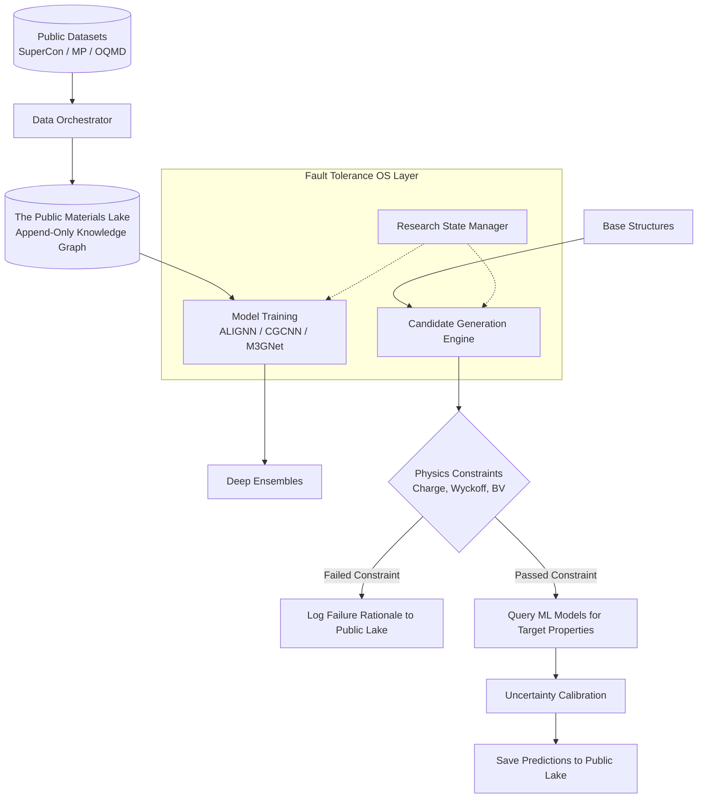

# Q-MATIS: Quantum Materials Intelligence System


<div align="center">
  <strong>A Scientific Operating System for Autonomous Materials Discovery</strong>
</div>
<br/>
<div align="center">
  <a href="#the-manifesto">The Manifesto</a> •
  <a href="#core-architecture">Core Architecture</a> •
  <a href="#the-public-knowledge-graph">The Public Knowledge Graph</a> •
  <a href="#installation">Installation</a> •
  <a href="#roadmap">Roadmap</a>
</div>
<br/>

## The Manifesto: Science as a Public Memory

Historically, the discovery of novel materials has been crippled by a simple flaw: **failed experiments are thrown away.** 

When a machine learning model generates $100,000$ crystal candidates and rejects $99,990$ of them due to structural instability, that negative data is lost forever. When a DFT calculation fails to converge, the result is buried.

Q-MATIS is a comprehensive **Scientific Operating System** designed to orchestrate the entire lifecycle of autonomous materials discovery. Its foundational philosophy is that *no data is ever lost*.

Q-MATIS is built to foster a **long-term public community**. Every single experiment—including every failed structure, every rejected mathematical hypothesis, and every dead-end—is permanently logged in an immutable, append-only database. We believe that a public ledger of scientific failures is just as crucial for the future of foundation models as a ledger of successes.

---

## Core Architecture

As an operating system, Q-MATIS acts as the orchestration layer between raw data, deep learning, domain physics, and distributed computing. 

### 1. The Immutable Materials Lake (QMKG)
The heart of Q-MATIS is the **Materials Knowledge Graph (QMKG)**. Backed by a hybrid SQLite/Parquet engine, it operates like Git for science:
- **`MaterialEntity`**: Every generated crystal receives a permanent UUID and tracks its parent-child lineage.
- **Physics Audits**: Hard logs of exactly *why* a candidate failed a check (e.g., failed Goldschmidt tolerance).
- **Public Ledger**: The lake is designed to be shared, distributed, and mined by the public community to train the next generation of Universal Foundation Models.

### 2. Physics-Constrained Generation Engine
Before any neural network is invoked, Q-MATIS subjects candidate materials to rigorous, universal domain-knowledge filters:
- **Charge Neutrality & Oxidation State Validation**
- **Wyckoff Position Preservation**
- **Ionic Radius & Electronegativity Constraints**
- **Bond-Valence Heuristics**

### 3. Fault-Tolerant Research State Management
Built to run on unreliable High-Performance Computing (HPC) nodes, Q-MATIS provides native, multi-level resumability. If a node is preempted while screening 5,000,000 compounds, the `ResearchStateManager` ensures the script instantaneously resumes at the exact sub-batch index where it died. No compute cycle is ever wasted.

### 4. Deep Graph Neural Networks
Q-MATIS seamlessly integrates state-of-the-art architectures (like ALIGNN and CGCNN) to act as ultra-fast surrogate models for any target property (Critical Temperature, Formation Energy, Bandgap). Active Learning bounds these predictions with epistemic uncertainty via Deep Ensembles.

---

## System Diagram



---

## Installation

Q-MATIS requires Python 3.10+ and a CUDA-capable GPU.

```bash
# Clone the repository
git clone https://github.com/RYuK006/Q-MATIS.git
cd Q-MATIS

# (Optional) Create a virtual environment
python -m venv .venv
source .venv/bin/activate  # On Windows: .venv\Scripts\activate

# Install dependencies
pip install -r requirements.txt
```

### Environment Setup
1. Obtain necessary API keys (e.g., [Materials Project](https://next-gen.materialsproject.org/)).
2. Copy the environment template: `cp .env.example .env`
3. Add your keys to `.env`: `MP_API_KEY=your_key_here`

---

## Roadmap

Q-MATIS is actively undergoing continuous architectural scaling to support the global materials science community.

- [x] **Phase A:** Core ML Pipeline, GNN Encoders (ALIGNN), Multi-Task Learning.
- [x] **Phase B1:** Physics-Constrained Discovery Engine (Domain-knowledge filtering).
- [x] **Phase B2:** Materials Knowledge Graph (Append-only public ledger of experiments).
- [x] **Phase B3:** Fault-Tolerant Research State Management (OS-level resumability).
- [ ] **Phase C:** High-Throughput Virtual Screening (HTVS) Cluster Orchestration.
- [ ] **Phase D:** Automated DFT Validation Queues (VASP / Quantum ESPRESSO).
- [ ] **Phase E:** Generative Crystal Design via Flow Matching / Diffusion.

---

## License

This project is licensed under the [MIT License](LICENSE).

## Citation

If you use Q-MATIS in your research or mine the public Materials Lake, please cite:
```bibtex
@software{q_matis_2026,
  author = {Q-MATIS Contributors},
  title = {Q-MATIS: A Scientific Operating System for Autonomous Materials Discovery},
  year = {2026},
  publisher = {GitHub},
  url = {https://github.com/RYuK006/Q-MATIS}
}
```
