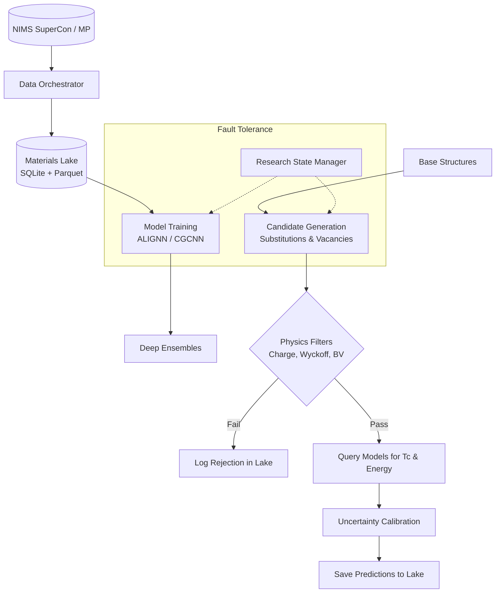

# Q-MATIS: Quantum Materials Intelligence System


<div align="center">
  <strong>An Autonomous, Fault-Tolerant Materials Discovery Engine & Scientific Memory System</strong>
</div>
<br/>
<div align="center">
  <a href="#scientific-vision">Scientific Vision</a> •
  <a href="#core-pillars">Core Pillars</a> •
  <a href="#repository-architecture">Architecture</a> •
  <a href="#installation">Installation</a> •
  <a href="#roadmap-and-phases">Roadmap</a>
</div>
<br/>

## Project Overview

**Q-MATIS (Quantum Materials Intelligence System)** has evolved from a standard machine learning pipeline into a highly resilient, autonomous **High-Throughput Virtual Screening (HTVS) engine**. It is designed to relentlessly discover, evaluate, and structurally validate novel high-temperature superconductors.

Unlike traditional scripts that discard generated candidates after inference, Q-MATIS operates as an append-only **Scientific Memory System**. Every generated structure, every physics constraint evaluated, every model prediction, and every pipeline failure is permanently logged into the **Materials Knowledge Graph (QMKG)**. 

---

## Scientific Vision

The discovery of high-temperature superconductors (HTS) is historically driven by serendipitous trial-and-error. Navigating the $10^{100}$ possible stable compounds requires moving beyond simple ML models. 

Q-MATIS attacks this by combining:
1. **Deep Graph Neural Networks (ALIGNN, CGCNN)** to act as ultra-fast surrogate models for $T_c$ and formation energy.
2. **Physics-Constrained Generation** to prune mathematically invalid crystals before they ever reach the neural network.
3. **Resumable State Management** to allow multi-million compound screenings to survive cluster preemptions, network failures, and hardware crashes natively.

---

## Core Pillars

### 1. Materials Knowledge Graph (QMKG) & Data Lake
We enforce a strict "append-only, never overwrite" philosophy, inspired by Git and event-sourcing. The `MaterialsLake` utilizes a hybrid SQLite + Parquet backend to store:
- **`MaterialEntity`**: Every crystal structure generated receives a permanent UUID and parent-child lineage tracking.
- **`PhysicsAuditRecord`**: Hard logs of why a candidate was rejected (e.g., failed Goldschmidt tolerance).
- **`ExperimentRecord`**: Complete reproducibility logging (config snapshots, random seeds, Git commits).

### 2. Physics-Aware Candidate Engine
To prevent generating "garbage" chemical formulas, the discovery engine subjects candidates to rigorous domain-knowledge filters *before* prediction:
- **Charge Neutrality & Oxidation State Validation**
- **Wyckoff Position Preservation**
- **Ionic Radius & Electronegativity Constraints**
- **Bond-Valence Heuristics**

### 3. Fault-Tolerant Research State Manager
Q-MATIS is built to run on unreliable High-Performance Computing (HPC) nodes. The `ResearchStateManager` provides multi-level resumability:
- **Level 1 (Epoch Checkpoints):** Deep learning weights, optimizers, and schedulers are continuously persisted.
- **Level 2 (Pipeline Stages):** The overall macro-state (Data Prep $\rightarrow$ Pretrain $\rightarrow$ Finetune) is tracked.
- **Level 3 (Candidate Micro-Cursors):** When generating millions of crystals, exact sub-batch indices are logged. If a cluster dies at candidate 1,412,031, restarting the job instantaneously resumes at 1,412,032.

### 4. Deep Ensembles & Active Learning
To navigate the unmapped chemical space, predictions are bounded by epistemic uncertainty using Deep Ensembles. The Active Learning framework evaluates generated candidates based on an Upper Confidence Bound (UCB) utility function, surfacing only the most promising materials for DFT verification.

---

## Repository Architecture



---

## Installation

Q-MATIS requires Python 3.10+ and a CUDA-capable GPU.

```bash
# Clone the repository
git clone https://github.com/RYuK006/Q-MATIS.git
cd Q-MATIS

# (Optional) Create a virtual environment
python -m venv .venv
source .venv/bin/activate  # On Windows: .venv\Scripts\activate

# Install dependencies
pip install -r requirements.txt
```

### Preparing Datasets
To map chemical formulas to 3D structures, Q-MATIS interfaces with the Materials Project.
1. Obtain an API key from [Materials Project](https://next-gen.materialsproject.org/).
2. Copy the environment template: `cp .env.example .env`
3. Add your key to `.env`: `MP_API_KEY=your_key_here`

---

## Roadmap and Phases

Q-MATIS is actively undergoing a massive architectural transformation. 

- [x] **Phase A1-A5:** Core ML Pipeline, GNN Encoders (ALIGNN), Multi-Task Learning, and Baselines.
- [x] **Phase B1:** Physics-Constrained Discovery Engine (Domain-knowledge filtering).
- [x] **Phase B2:** Materials Knowledge Graph (Append-only SQLite/Parquet registry).
- [x] **Phase B3:** Fault-Tolerant Research State Management (Multi-level resumability).
- [ ] **Phase C:** High-Throughput Virtual Screening (HTVS) Integration.
- [ ] **Phase D:** Automated DFT Validation (VASP / Quantum ESPRESSO queues).
- [ ] **Phase E:** Generative Crystal Design via Flow Matching / Diffusion.

---

## License

This project is licensed under the [MIT License](LICENSE).

## Citation

If you use Q-MATIS in your research, please cite:
```bibtex
@software{q_matis_2026,
  author = {Q-MATIS Contributors},
  title = {Q-MATIS: Quantum Materials Intelligence System},
  year = {2026},
  publisher = {GitHub},
  url = {https://github.com/RYuK006/Q-MATIS}
}
```
