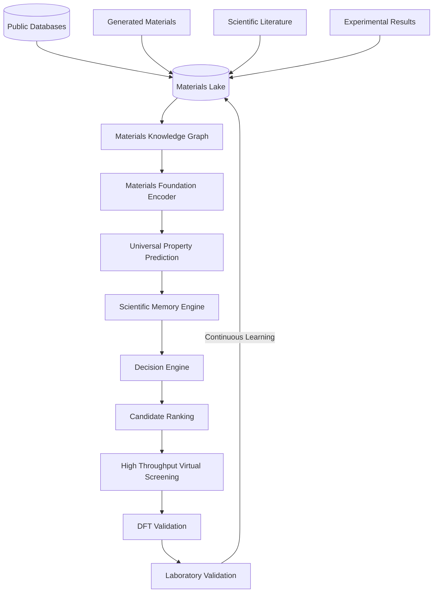

# Q-MATIS: Quantum Materials Intelligence System

<div align="center">
  
</div>
<br/>

<div align="center">
  <strong>Building the world's scientific memory for materials.</strong>
</div>
<br/>
<div align="center">
  <a href="#why-q-matis-exists">Why Q-MATIS Exists</a> •
  <a href="#mission">Mission</a> •
  <a href="#core-architecture">Architecture</a> •
  <a href="#scientific-memory-engine">Scientific Memory</a> •
  <a href="#roadmap">Roadmap</a>
</div>
<br/>

## Why Q-MATIS Exists

Historically, the discovery of novel materials has been crippled by a simple flaw: **failed experiments are thrown away.** 

When a machine learning model generates 100,000 crystal candidates and rejects 99,990 of them due to structural instability, that negative data is lost forever. When a DFT calculation fails to converge, the result is buried. When a physical experiment yields a mundane result, it is never published.

These negative results are scientifically invaluable. Future AI systems should learn from both successes and failures.

Q-MATIS exists to fix this. We are building a permanent AI-powered knowledge system that preserves every material, every prediction, every experiment, every simulation, every failure, and every scientific decision. This is not just a machine learning model; it is a decades-long scientific infrastructure designed to learn, preserve, predict, organize, and continuously expand scientific knowledge about every crystalline material ever discovered or generated.

## Mission

Q-MATIS aims to become an AI operating system for materials science.

While discovering a room-temperature superconductor is the first downstream benchmark application validating our platform, it is not our final objective. 

Q-MATIS is built to act as the universal foundation for:
- Superconductors
- Batteries
- Catalysts
- Hydrogen storage
- Photovoltaics
- Thermoelectrics
- Semiconductors
- Topological materials
- Quantum materials
- Structural alloys
- Future material applications that do not yet exist

All of these represent downstream tasks built upon a single, shared, centralized materials foundation.

## Core Architecture

Q-MATIS operates as a continuous feedback loop. Science never ends, and knowledge continually grows. 



## Scientific Memory Engine

This is an append-only scientific ledger. Every object in Q-MATIS is versioned. **Nothing is overwritten. Nothing is deleted. Everything becomes permanent scientific history.**

The system stores:
- generated materials & imported materials
- crystal structures & crystal graphs
- embeddings
- predicted properties & experimentally measured properties
- DFT calculations & literature references
- checkpoints & configurations
- experiment metadata & model versions
- training metrics & uncertainty estimates
- accepted candidates, rejected candidates, and rejection reasons
- physics filter decisions
- candidate lineage & parent-child mutations
- timestamps, hardware metadata, software versions, and git commits

Every scientific decision remains reproducible forever.

## Scientific Principles

- **Science is cumulative:** We build on the past; we never erase it.
- **Negative results are valuable:** Knowing what doesn't work is required to learn what does.
- **Nothing is overwritten:** Data is strictly append-only.
- **Every prediction is reproducible:** Perfect state-tracking ensures we can rewind to any exact mathematical conclusion.
- **Every material has a permanent identity:** Universally unique identifiers track materials across space and time.
- **AI should assist scientific discovery, not replace scientific reasoning:** AI is a tool, not a substitute for physical constraints and human validation.
- **Models evolve, but scientific memory persists:** Checkpoints decay, but the raw experimental truth remains forever.

## The Universal Materials Lake

The Materials Lake is intended to become a universal repository containing every known property of every material. New information is appended rather than replacing existing values.

This includes:
- **Properties:** Structural, Chemical, Electronic, Mechanical, Magnetic, Thermal, Optical, Transport, Topological, Phonon, Elastic, Thermodynamic
- **Sources:** Experimental, Computational, Prediction
- **Metadata:** Provenance, Embeddings, Decision history, Lineage, Model history, Version history, Confidence, Uncertainty, Future measurements

## Future Foundation Model

The long-term objective of Q-MATIS is to train a universal **Materials Foundation Model**. A single encoder should eventually understand the physics of all crystalline matter.

Specialized prediction heads will attach to this encoder to solve diverse tasks like:
- Tc prediction (Superconductivity)
- Formation Energy & Band Gap
- Elastic Modulus & Hardness
- Magnetic Moment & Density
- Thermal Conductivity & Dielectric Constant
- Catalytic Activity & Battery Voltage
- Hydrogen Storage

The encoder will become reusable for any future property prediction task, massively reducing the barrier to entry for novel materials design. Our current implementations (CGCNN, ALIGNN) are the stepping stones toward this objective.

## Q-MATIS vs. Traditional ML Pipelines

| Feature | Traditional AI Pipelines | Q-MATIS |
|---------|-------------------------|---------|
| **Scope** | One task / One property | Universal platform |
| **Data Storage** | Separate, fragmented datasets | Unified Materials Lake |
| **Record Keeping** | Results discarded / overwritten | Append-only Scientific Memory |
| **Provenance** | Limited reproducibility | Permanent provenance & lineage |
| **Architecture** | Independent standalone models | Shared Foundation encoder |
| **Workflow** | Static experiments | Continuous closed-loop discovery |

## Current Development Status

- **Phase A:** Completed (Core encodings, ALIGNN/CGCNN integration)
- **Phase B:** In Progress (Fault-Tolerant Scientific Platform, Universal Materials Lake)
- **Phase C:** Planned (High-Throughput Virtual Screening)

Current active development is focused on the **Scientific Memory, Knowledge Graph, Fault-tolerant execution, Physics-constrained discovery, and Universal property prediction.**

## Roadmap

Q-MATIS is built for a decades-long scientific vision:
1. **Research Foundation**
2. **Universal Materials Knowledge Graph**
3. **Physics-Constrained Discovery**
4. **Fault-Tolerant Scientific Platform**
5. **High-Throughput Virtual Screening**
6. **Universal Property Prediction**
7. **Materials Foundation Model**
8. **Retrieval-Augmented Scientific Memory**
9. **Closed-Loop Autonomous Discovery**
10. **AI-Assisted Laboratory Integration**
11. **Global Collaborative Materials Database**

## Installation

Q-MATIS requires Python 3.10+ and a CUDA-capable GPU.

```bash
# Clone the repository
git clone https://github.com/RYuK006/Q-MATIS.git
cd Q-MATIS

# (Optional) Create a virtual environment
python -m venv .venv
source .venv/bin/activate  # On Windows: .venv\Scripts\activate

# Install dependencies
pip install -r requirements.txt
```

## Long-Term Vision

Q-MATIS is intended to grow over decades. Rather than solving one isolated scientific problem, it aims to become permanent scientific infrastructure capable of supporting future AI systems, autonomous laboratories, and materials discovery across every scientific discipline.

## Citation

If you use Q-MATIS in your research or mine the public Materials Lake, please cite:
```bibtex
@software{q_matis_2026,
  author = {Q-MATIS Contributors},
  title = {Q-MATIS: Building the world's scientific memory for materials},
  year = {2026},
  publisher = {GitHub},
  url = {https://github.com/RYuK006/Q-MATIS}
}
```

## Every system begins as an idea. Every legacy begins with the first commit.
