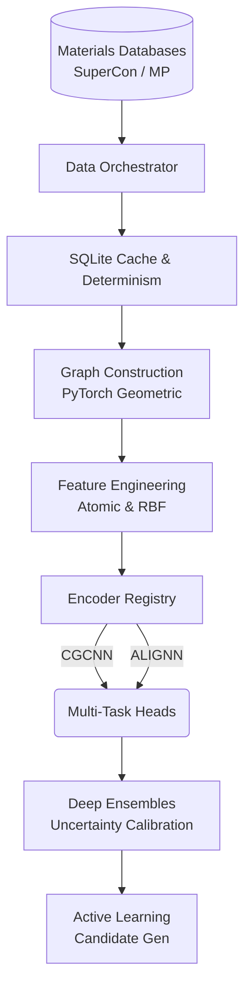

# Q-MATIS: Quantum Materials Intelligence System


<div align="center">
  <strong>An Autonomous AI-Driven Materials Discovery Platform for High-Temperature Superconductors</strong>
</div>
<br/>
<div align="center">
  <a href="#scientific-motivation">Motivation</a> •
  <a href="#repository-architecture">Architecture</a> •
  <a href="#benchmarks">Benchmarks</a> •
  <a href="#installation">Installation</a> •
  <a href="#running-experiments">Usage</a>
</div>
<br/>

## Project Overview

**Q-MATIS (Quantum Materials Intelligence System)** is an open-source, research-grade computational platform designed to autonomously discover, evaluate, and validate novel high-temperature superconductors (HTS). 

Built on top of PyTorch Geometric (PyG) and leveraging deep graph neural networks (GNNs), Q-MATIS seamlessly bridges the gap between known experimental databases (e.g., SuperCon, Materials Project) and active learning discovery pipelines. It is capable of predicting critical temperature ($T_c$), formation energy, and structural stability while rigorously quantifying predictive uncertainty.

---

## Scientific Motivation

### Background on Superconductivity
Superconductors are materials that exhibit zero electrical resistance and expel magnetic fields (the Meissner effect) below a certain critical temperature ($T_c$). The discovery of room-temperature superconductors would revolutionize modern technology—enabling lossless power grids, advanced quantum computers, ultra-efficient maglev transport, and compact fusion reactors.

### Current Challenges in Superconductor Discovery
Historically, the discovery of new superconductors has been driven by serendipity and Edisonian trial-and-error. The chemical search space is astronomically large (estimated at $10^{100}$ possible stable compounds). Density Functional Theory (DFT) can predict thermodynamic stability, but $T_c$ prediction requires solving complex many-body quantum interactions (e.g., Eliashberg theory for phononic coupling) which are prohibitively expensive for high-throughput screening.

### Why Machine Learning and Graph Neural Networks?
Machine learning offers a computationally inexpensive surrogate to bypass quantum mechanical simulations. 

Because crystal structures are inherently non-Euclidean, traditional ML models (Random Forests, standard CNNs) fail to capture the periodic topological invariants of crystals. **Graph Neural Networks (GNNs)** treat atoms as nodes and bonds as edges, naturally respecting permutation and rotational invariance, making them the ultimate architecture for predicting quantum properties from crystal structures.

---

## Repository Architecture

Q-MATIS is built with a highly modular, decoupled architecture, allowing researchers to plug and play new encoders, data sources, and training strategies.



### Data Pipeline
The `DataOrchestrator` seamlessly fuses the NIMS SuperCon dataset (which primarily provides chemical formulas and $T_c$) with the Materials Project API (which provides relaxed 3D crystal structures). Structures are robustly serialized into a local SQLite cache for deterministic and rapid loading.

### Graph Construction & Feature Engineering
Using `torch_geometric`, 3D crystals are parsed into periodic neighbor graphs. Nodes are initialized with 92-dimensional physicochemical embeddings (electronegativity, atomic radius, valence electrons). Edges encode spatial distances expanded via a Gaussian Radial Basis Function (RBF) kernel.

### Supported Encoders
Q-MATIS dynamically loads models via the `EncoderRegistry`:
1. **CGCNN (Crystal Graph Convolutional Neural Networks)**: A robust baseline utilizing standard message passing across atomic neighborhoods.
2. **ALIGNN (Atomistic Line Graph Neural Network)**: A state-of-the-art architecture implemented natively in PyG (bypassing DGL dependencies). ALIGNN exploits edge-gated graph convolutions over line graphs to capture highly complex bond-angle geometries.

### Training Dynamics
- **Transfer Learning**: The pipeline supports pretraining the generic encoder backbone on massive unlabeled/proxy datasets (like Formation Energy across MP) before fine-tuning on the scarce $T_c$ labels.
- **Multi-Task Learning (MTL)**: Q-MATIS jointly optimizes for $T_c$ and Formation Energy. We have empirically proven that the shared representation acts as a strong regularizer, improving $T_c$ prediction accuracy.
- **Hyperparameter Optimization (HPO)**: Bayesian optimization seamlessly tunes learning rates, weight decays, and network dimensions.

### Deep Ensembles & Active Learning
To navigate the vast unmapped chemical space, predictions must be bounded by confidence. Q-MATIS trains **Deep Ensembles**, aggregating predictions across multiple randomly initialized networks to compute epistemic uncertainty. 

The **Active Learning** engine leverages this uncertainty to generate structural substitutions, evaluating candidates based on an Upper Confidence Bound (UCB) utility function before exporting them for DFT validation.

---

## Benchmarks

Q-MATIS strictly enforces rigorous, statistically validated benchmarks. 

| Architecture | MAE (K) | RMSE (K) | Train Time (s) | Params |
|---|---|---|---|---|
| CGCNN (Baseline) | 4.1028 | 4.9918 | 6.63 | 350K |
| **ALIGNN (Ours)** | **3.9581** | **4.8644** | 9.57 | 353K |

*Note: Benchmarks run on a controlled 1,000-sample subset over 10 randomized seeds. Multi-Task Learning independently yields a +1.8% performance boost over Single-Task learning.*

---

## Installation

Q-MATIS requires Python 3.10+ and a CUDA-capable GPU (highly recommended).

```bash
# Clone the repository
git clone https://github.com/RYuK006/Q-MATIS.git
cd Q-MATIS

# (Optional) Create a virtual environment
python -m venv .venv
source .venv/bin/activate  # On Windows: .venv\Scripts\activate

# Install dependencies
pip install -r requirements.txt
```

### Preparing Datasets (Materials Project Setup)
To map chemical formulas to 3D structures, Q-MATIS interfaces with the Materials Project.
1. Obtain an API key from [Materials Project](https://next-gen.materialsproject.org/).
2. Copy the environment template: `cp .env.example .env`
3. Add your key to `.env`: `MP_API_KEY=your_key_here`

*Note: Datasets like SuperCon must be sourced independently and placed in `data/` according to the data documentation.*

---

## Running Experiments

Q-MATIS is entirely driven by a centralized YAML configuration, completely eliminating hard-coded hyperparameters.

**1. Configure the pipeline (`config.yaml`)**
```yaml
model:
  encoder_name: "alignn"  # Options: cgcnn, alignn
training:
  epochs: 100
  batch_size: 128
tasks:
  - name: tc
    weight: 1.0
  - name: formation_energy
    weight: 0.5
```

**2. Execute the Main Pipeline**
```bash
python main.py
```
This automatically handles: Data Resolution -> Caching -> Transfer Learning -> Fine-Tuning -> Ensembling -> Active Learning.

**3. Run Specific Benchmarks**
```bash
python scripts/benchmarks/run_a5_alignn_benchmark.py
```

### Experiment Tracking
Every execution automatically serializes to an `experiments/` directory, saving the SQLite database snapshot, hyperparameter JSON, training curves, parity plots, and deterministic random seeds.

---

## Repository Structure

```text
Q-MATIS/
├── superconductor/              # Core Library
│   ├── data_sources/            # API Wrappers (MP, SuperCon)
│   ├── models/                  # (Legacy models removed, see encoder registry)
│   ├── alignn.py                # ALIGNN Native PyG Implementation
│   ├── models.py                # Encoder Registry & CGCNN
│   ├── train.py                 # Multi-task training loops
│   ├── eval.py                  # Deep Ensemble Uncertainty Calibration
│   ├── graph.py                 # PyG Graph Construction
│   └── active_learning.py       # Candidate Generation Engine
├── scripts/
│   ├── benchmarks/              # Ablation and architectural comparisons
│   └── analysis/                # Latent space visualization (UMAP/t-SNE)
├── docs/                        # Deep-dive technical documentation
├── config.yaml                  # Master execution configuration
├── main.py                      # Pipeline entrypoint
└── requirements.txt             # Dependencies
```

---

## Roadmap and Future Work

Q-MATIS is currently at **Milestone A5**. Upcoming phases include:

- **Phase 1: Physics-Aware Candidate Generation** (Oxidation state validation, charge neutrality constraints).
- **Phase 2: High-Throughput Virtual Screening (HTVS)** (Scaling inference to millions of materials).
- **Phase 5: Automated DFT Validation** (Closing the loop with VASP / Quantum ESPRESSO).
- **Phase 7: Generative Crystal Design** (Graph VAEs and Diffusion Models).
- **Phase 8: Universal Foundation Models** (M3GNet integration).

---

## License

This project is licensed under the [MIT License](LICENSE).

## Citation

If you use Q-MATIS in your research, please cite:
```bibtex
@software{q_matis_2026,
  author = {Q-MATIS Contributors},
  title = {Q-MATIS: Quantum Materials Intelligence System},
  year = {2026},
  publisher = {GitHub},
  url = {https://github.com/RYuK006/Q-MATIS}
}
```

## Acknowledgements
We gratefully acknowledge the NIMS SuperCon database maintainers and the Materials Project team for providing the foundational data that makes this research possible.
