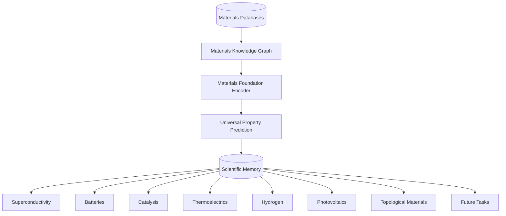

# Q-MATIS: Quantum Materials Intelligence System

<div align="center">
  
</div>
<br/>

<div align="center">
  <strong>A Universal Materials Intelligence Platform</strong>
</div>
<br/>
<div align="center">
  <a href="#mission-a-universal-platform">Mission</a> •
  <a href="#core-architecture">Architecture</a> •
  <a href="#scientific-memory">Scientific Memory</a> •
  <a href="#roadmap">Roadmap</a>
</div>
<br/>

## Mission: A Universal Platform

Q-MATIS is a **Universal Materials Intelligence Platform** that learns, stores, predicts, and continuously expands scientific knowledge about every crystalline material. Our long-term goal is to create a permanent scientific memory for materials science.

Q-MATIS aims to become an AI operating system for materials discovery capable of supporting many diverse scientific domains. While discovering a room-temperature superconductor was our foundational challenge, **superconductivity is only the first downstream application and benchmark**, not the final objective.

Q-MATIS is built to act as the foundation for:
- Superconductors
- Batteries
- Catalysts
- Thermoelectrics
- Photovoltaics
- Hydrogen storage
- Quantum materials
- Topological materials
- Semiconductors

All of these domains represent downstream tasks that are built upon a shared, centralized materials foundation model within Q-MATIS.

---

## Core Architecture

Q-MATIS abstracts away the complexity of materials informatics by providing a layered AI operating system. 



### 1. Scientific Memory

The fundamental philosophy of Q-MATIS is that **no scientific data is ever lost or overwritten.** Science thrives on a public ledger of successes and failures.

Q-MATIS operates an append-only Scientific Memory that permanently stores:
- Every generated material
- Every imported material
- Every prediction
- Every model version
- Every checkpoint
- Every experiment
- Every decision
- Every rejected candidate
- Every accepted candidate
- Every DFT result
- Every experimental validation
- Every configuration snapshot
- Every lineage relationship

When a mathematical hypothesis leads to a dead-end, or a structure collapses due to instability, that negative data is preserved. Every scientific decision remains fully reproducible.

### 2. The Universal Materials Lake (QMKG)

The heart of our data infrastructure is the **Materials Lake**, an immutable repository intended to become a universal dataset containing:
- Structures and crystal graphs
- Learned embeddings
- Physical, electronic, mechanical, thermal, and magnetic properties
- Complete provenance and lineage
- Predictive uncertainty limits
- Prediction history
- Literature references
- DFT calculations
- Future experimental data

### 3. Deep Graph Neural Networks & Transfer Learning

Q-MATIS seamlessly integrates state-of-the-art graph architectures to act as ultra-fast surrogate models:
- **CGCNN** (Crystal Graph Convolutional Neural Networks)
- **ALIGNN** (Atomistic Line Graph Neural Network)

We utilize Multi-Task Learning and Transfer Learning to cross-pollinate insights across domains (e.g., using a pre-trained formation energy encoder to warm-start critical temperature prediction).

### 4. Physics-Constrained Candidate Generation & Active Learning

Before any neural network makes a prediction, the Candidate Generation Engine subjects materials to rigorous, universal domain-knowledge filters (e.g., charge neutrality, oxidation states, Wyckoff preservation, bond-valence heuristics). 

Combined with Active Learning frameworks, Q-MATIS intelligently navigates the vast combinatorial chemical space by evaluating candidates bounded by epistemic uncertainty via Deep Ensembles.

### 5. Future Foundation Model

The long-term objective of Q-MATIS is training a universal **Materials Foundation Model** capable of predicting hundreds of material properties from a single encoder. Our current implementations of CGCNN and ALIGNN serve as crucial stepping stones toward that massive multi-modal objective.

---

## Roadmap

Q-MATIS is continuously scaling from a focused research prototype to a universal platform:

- [x] **Research Foundation:** Core ML Pipeline, GNN Encoders (ALIGNN/CGCNN), Multi-Task Learning.
- [x] **Universal Materials Knowledge Graph:** Append-only SQLite/Parquet ledger.
- [x] **Physics-Constrained Discovery:** Domain-knowledge filtering and active learning.
- [x] **Fault-Tolerant Scientific Platform:** OS-level resumability and research state management.
- [ ] **High-Throughput Virtual Screening:** Distributed HTVS cluster orchestration.
- [ ] **Universal Property Prediction:** Multi-domain property mapping.
- [ ] **Materials Foundation Model:** Training the unified single-encoder representation.
- [ ] **Autonomous Scientific Discovery:** Fully closed-loop AI experimentation.
- [ ] **AI-Assisted Laboratory Integration:** Bridging virtual screening with physical laboratory synthesis.

---

## Installation

Q-MATIS requires Python 3.10+ and a CUDA-capable GPU.

```bash
# Clone the repository
git clone https://github.com/RYuK006/Q-MATIS.git
cd Q-MATIS

# (Optional) Create a virtual environment
python -m venv .venv
source .venv/bin/activate  # On Windows: .venv\Scripts\activate

# Install dependencies
pip install -r requirements.txt
```

---

## Citation

If you use Q-MATIS in your research or mine the public Materials Lake, please cite:
```bibtex
@software{q_matis_2026,
  author = {Q-MATIS Contributors},
  title = {Q-MATIS: A Universal Materials Intelligence Platform},
  year = {2026},
  publisher = {GitHub},
  url = {https://github.com/RYuK006/Q-MATIS}
}
```
