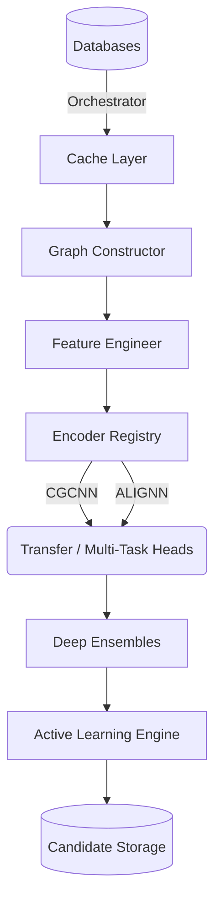

# System Architecture

Q-MATIS follows a modular, decoupled pipeline architecture designed to handle high-throughput crystal graph machine learning tasks.

## Core Subsystems
1. **Data Layer**: Standardizes atomic structures from disparate sources.
2. **Graph Construction Layer**: PyTorch Geometric representations.
3. **Model Layer**: Plug-and-play GNN encoders.
4. **Training Layer**: Transfer and multi-task optimization.
5. **Evaluation Layer**: Calibration and confidence bounding.
6. **Active Learning Layer**: Substitution, generative loops, and DFT orchestration.
