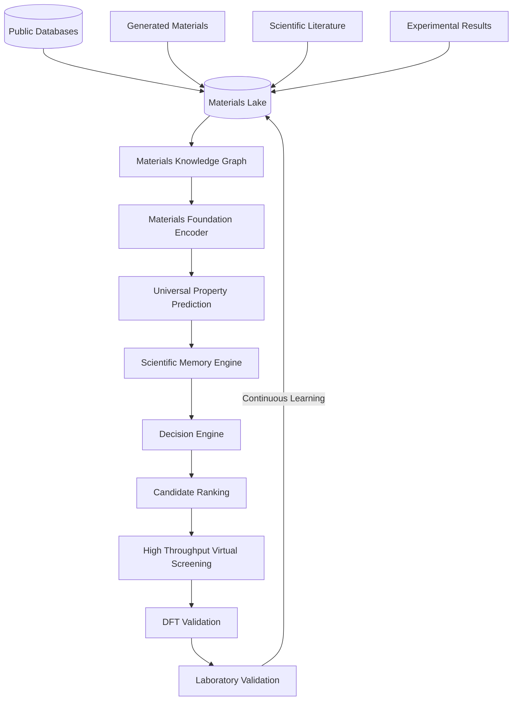

# Universal Platform Architecture

Q-MATIS follows a continuous feedback-loop architecture designed to act as a universal materials intelligence platform. It abstracts away the complexity of materials informatics by providing a layered AI operating system.

## Core Subsystems

1. **Materials Lake**: The immutable, append-only repository containing structures, properties, embeddings, and provenance for all data.
2. **Materials Knowledge Graph**: Relational graph representation organizing materials lineages and decision histories.
3. **Materials Foundation Encoder**: PyTorch Geometric representations (e.g., ALIGNN, CGCNN) encoding deep atomic and structural contexts.
4. **Universal Property Prediction**: Multi-domain prediction heads targeting properties across Superconductors, Batteries, Photovoltaics, and more.
5. **Scientific Memory Engine**: Versioned ledger ensuring no experimental result, failure, or negative data point is ever overwritten.
6. **Decision Engine & Active Learning**: AI-driven candidate generation, bounded by epistemic uncertainty, executing physics-constrained rules.
7. **Research Execution Engine**: Fault-tolerant OS layer managing state tracking, crashes, and seamless resumability.
