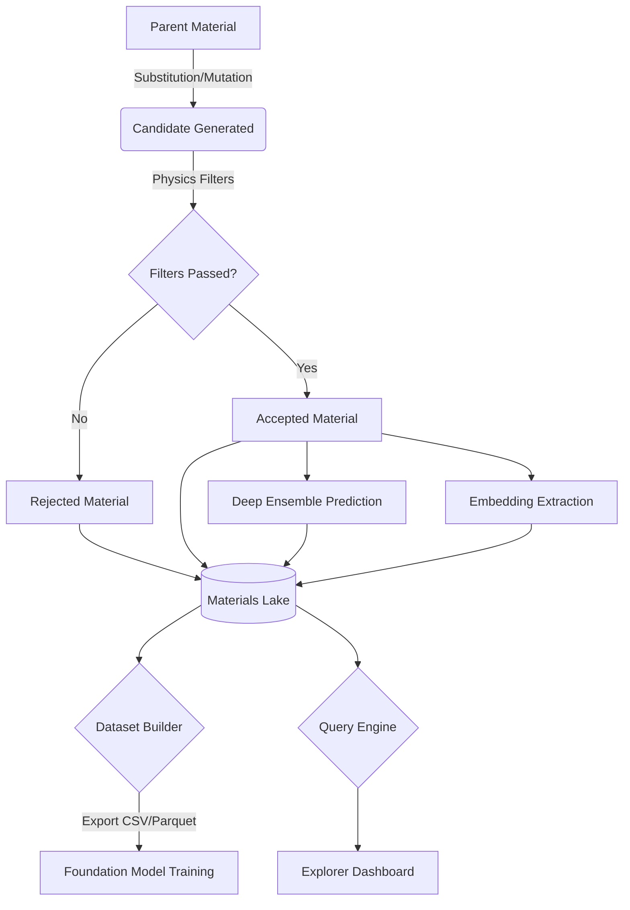

# Phase B2: Materials Knowledge Graph Architecture

This document describes the architectural transition of Q-MATIS into a persistent **Materials Knowledge Graph (QMKG)**.

## Core Principles
1. **Permanent Entities**: Every material (generated, rejected, or imported) becomes a lifelong entity with a unique `QMATIS-MAT-` ID.
2. **Append-Only Operations**: Information is never deleted or overwritten. Predictions, experiments, and validations are appended to a material's history.
3. **Full Lineage**: Complete traceability from the parent material to the mutated descendant.
4. **Foundation Model Readiness**: The system retains all structural embeddings and graph properties to directly support training future foundation models.

## Schema Overview

The `MaterialsLake` utilizes a scalable **SQLite + Embeddings (Numpy/Parquet)** hybrid schema.

### Tables
- **`materials`**: Identity (Formula, Strategy, Random Seed, Parent ID).
- **`properties`**: Key-Value physical/chemical properties (Measured, Predicted, DFT).
- **`decision_history`**: Audit trail of every action (Generated, Mutated, Rejected).
- **`physics_audits`**: Rigorous logging of filter logic (Pass/Fail, Thresholds).
- **`predictions`**: Deep ensemble predictions ($T_c$, Confidence, Physics Score).
- **`embeddings`**: Paths to high-dimensional latent vectors saved on disk.
- **`relationships`**: Edges for the Knowledge Graph (e.g., *Derived From*, *Duplicate Of*).

## Lifecycle Diagram

## Modules
- **`material_registry.py`**: Central ORM that enforces append-only insertions.
- **`query_engine.py`**: Provides fluent queries like `.is_rejected(False).has_tc_gt(50)`.
- **`dataset_builder.py`**: Extracts custom datasets for ML pipelines.
- **`explorer_dashboard.py`**: Auto-generates a Plotly HTML dashboard visualizing the entire graph's composition.
